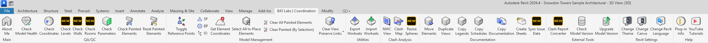
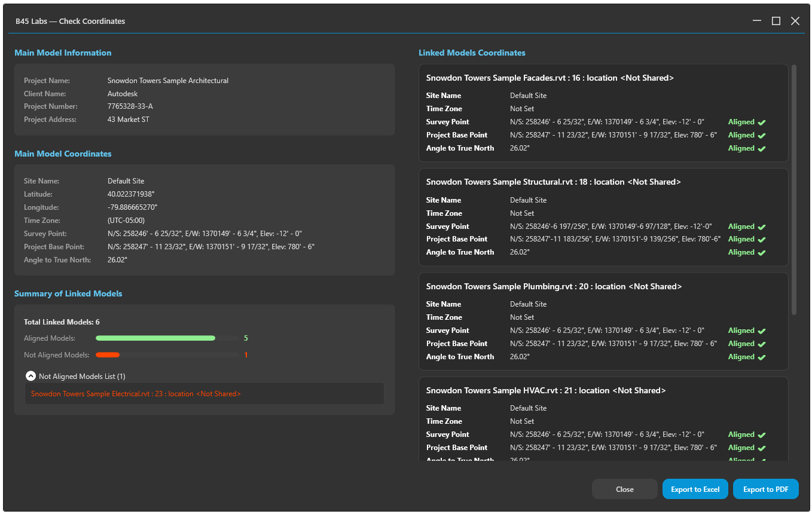
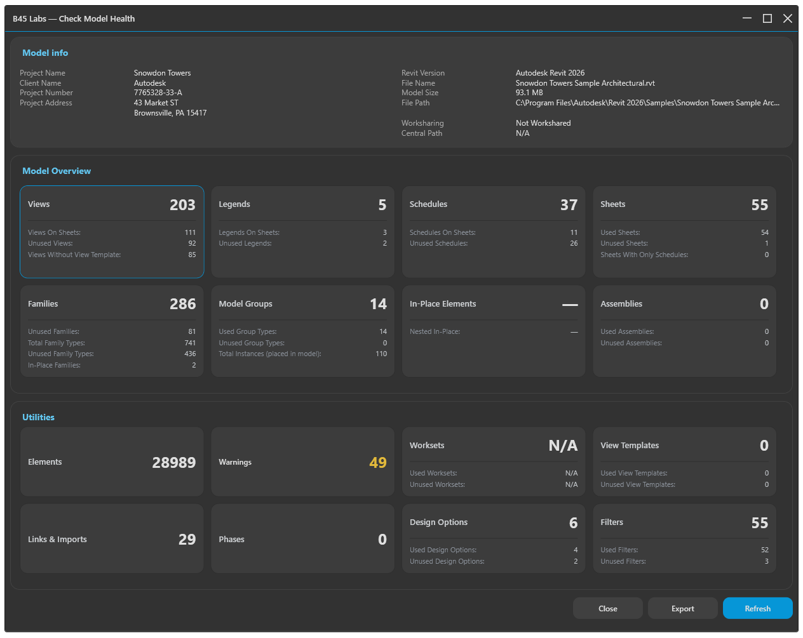
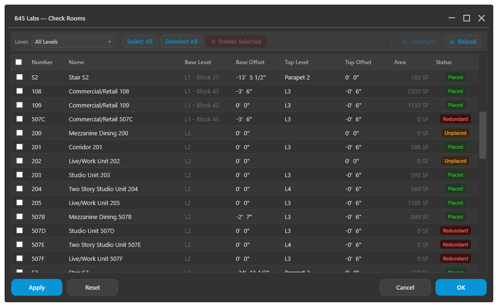
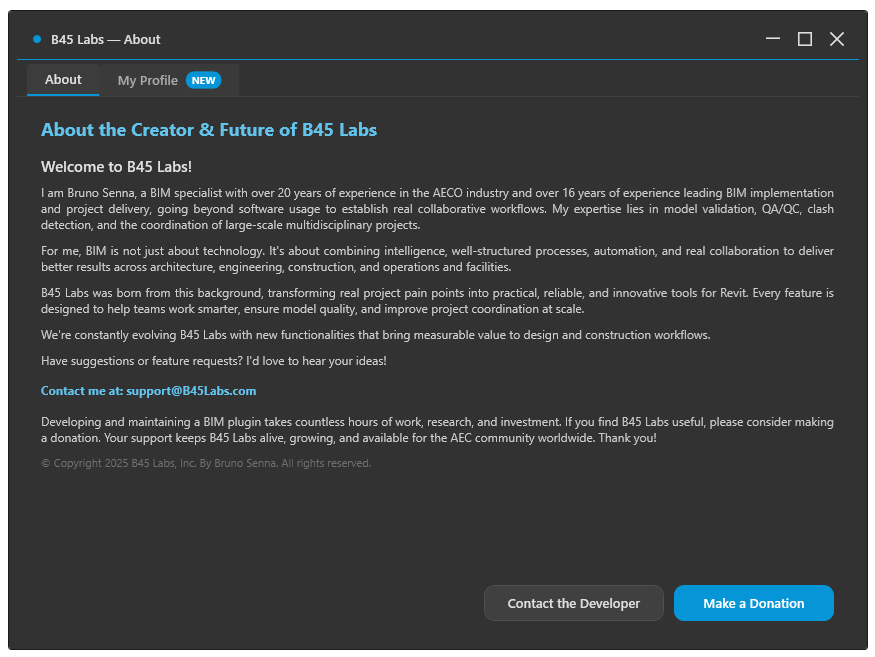

# B45 Labs — Revit Add-in

> B45 Labs is a productivity-focused Autodesk Revit add-in designed to streamline **coordination**, **auditing**, and **QA/QC** workflows for BIM teams.

> **Brand note:** Previously released as **BIM Genie**, rebranded to **B45 Labs**.

---

## 💛 Support This Project

If B45 Labs saves you time, consider supporting its development:

Your contributions help keep the project alive and growing. Thank you!

---

## 📸 Overview

*Full ribbon tab — all commands organized by category*

*Check Coordinates — validates Survey Point, Base Point, and Internal Origin*

*Check Model Health — full model audit with breakdown by category*

*Check Rooms — room naming, area, and placement validation *(new in v1.0.3)**

*Create Sheets — batch sheet creation from a template list*

*Sync Sheet Issue Date — batch-update issue date across multiple sheets *(new in v1.0.3)**

*My Profile — personalized experience with name, role, industry, and sector*

---

## ✨ Key Features

### 🔍 QA/QC
- Coordinate validation (Survey Point / Base Point / Internal Origin)
- Model health checks and diagnostics
- Level, wall, and room validation
- Parameter and content auditing

### 📄 Documentation
- Batch view, schedule, legend, and sheet utilities
- Sheet issue date synchronization
- Copy sheets and content from another model

### ⚙️ Model Management
- Check and upgrade external Revit file versions
- Export/import worksets
- Select and manage in-place elements

### 🎯 Clash Analysis
- NWC View generation
- Clash Map from Navisworks exports
- Resize Clash Spheres

### 👤 User Profile
- Name, preferred name, email, role, industry, and sector
- Avatar and greeting personalized with preferred name

---

## 📋 Requirements

| Requirement | Details |
|---|---|
| Autodesk Revit | 2023, 2024, 2025, or 2026 |
| Operating System | Windows |
| .NET | net48 (R23/R24) · net8.0-windows (R25/R26) |
| Admin rights | May be required depending on install location |

---

## 📦 Installation

### Option A — Installer *(recommended)*
1. Download the latest installer from [**Releases**](https://github.com/Bruno-Senna/B45Labs/releases).
2. Close Revit before installing.
3. Run the installer and follow the setup wizard.
4. Launch Revit and open the **B45 Labs** ribbon tab.

### Option B — Manual
1. Copy the add-in bundle (DLLs + dependencies) to your target directory.
2. Place the `.addin` manifest in the Revit Addins folder.
3. Ensure dependencies are present and unblocked by Windows.

> **Note:** Revit 2023 and 2024 use the `net48` build.  
> Revit 2025 and 2026 use the `net8.0-windows` build.

---

## 🛠️ Commands

### QA/QC
| Command | Description |
|---|---|
| Check Coordinates | Validates Survey Point / Base Point / Internal Origin |
| Check Model Health | Full model health audit |
| Check Levels | Level naming, elevation, and ordering |
| Check Walls | Wall types, constraints, and structural parameters |
| Check Rooms | Room naming, area, and placement |
| Check Parameters | Parameter auditing by category |
| Check Painted Elements | Detects painted materials |

### Documentation
| Command | Description |
|---|---|
| Move Views | Batch move views between sheets |
| Duplicate Views | Duplicate views with options |
| Copy Legends | Copy legends across sheets |
| Copy Schedules | Copy schedules across sheets |
| Create Sheets | Batch sheet creation |
| Copy Sheet From Model | Copy sheet content from another model |
| Sync Sheet Issue Date | Batch-update issue date across sheets |

### Model Management
| Command | Description |
|---|---|
| Toggle Reference Points | Show/hide Survey, Base, and Internal Origin |
| Get Element Coordinates | Precise element coordinates |
| Select All In-Place Elements | Batch select in-place families |
| Export / Import Worksets | Excel-based workset management |

### External Tools
| Command | Description |
|---|---|
| Check Model Version | Inspect Revit version of external files |
| Upgrade Model Version | Batch-upgrade external files |

---

## 🔄 Updates

B45 Labs includes a built-in update check. When a new version is available, you'll be notified inside Revit.

Download the latest version from [**Releases**](https://github.com/Bruno-Senna/B45Labs/releases).

---

## 📊 Telemetry

To improve stability and prioritize development, B45 Labs collects limited usage signals:
- Commands executed and usage counts
- Error logs
- Model metadata (name, element count, link count)
- Approximate region, device signals, Revit username

No sensitive data, file paths, model contents, or geometry is collected.  
See [PRIVACY.md](PRIVACY.md) for full details.

---

## 📚 Documentation

| Document | Description |
|---|---|
| [TERMS.md](TERMS.md) | Terms of Use / EULA |
| [PRIVACY.md](PRIVACY.md) | Privacy Policy |
| [EULA_B45Labs.md](EULA_B45Labs.md) | Full End User License Agreement |
| [CHANGELOG.md](CHANGELOG.md) | Version history |
| [THIRD_PARTY_NOTICES.md](THIRD_PARTY_NOTICES.md) | Open-source licenses |
| [SUPPORT.md](SUPPORT.md) | Support information |
| [SECURITY.md](SECURITY.md) | Security policy |

---

## 🆘 Support

Email: **support@B45Labs.com**

When reporting issues, please include:
- B45 Labs version
- Revit version (2023 / 2024 / 2025 / 2026)
- Steps to reproduce
- Screenshot (redact sensitive details)

---

## ©️ Copyright

Copyright (c) 2026 B45 Labs. All rights reserved.  
Use of this Software is governed by [TERMS.md](TERMS.md).
